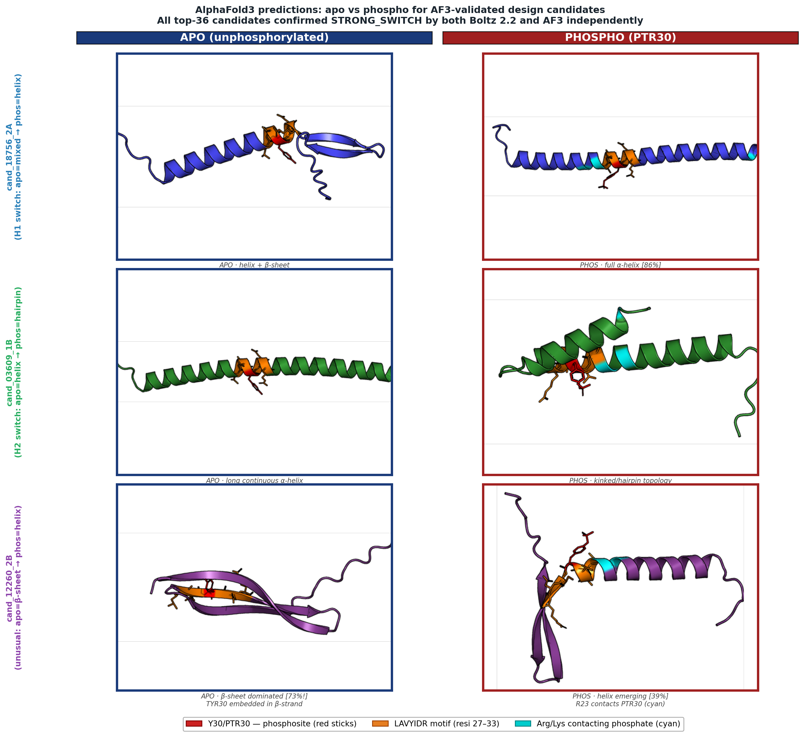
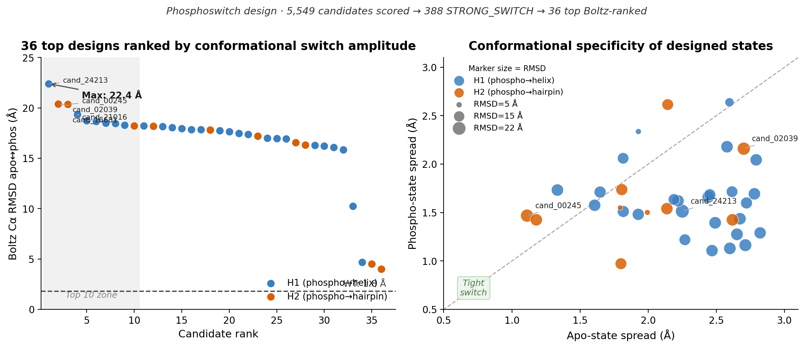

# phosphoswitch-design

> **Part of the [Proteus Design](https://github.com/cdarbellay) framework** — backbone-explicit,
> thermodynamically grounded multi-state protein design. Named after Proteus, the Greek sea god
> who could change his shape at will.

Multi-state protein design pipeline for bidirectional phosphoswitches.

**Target:** LMNA Y45 (Src kinase phosphorylation site) · 59-aa construct · Y45 = position 30  
**Biology:** Design sequences that switch conformation upon phosphorylation — straight helix ↔ pulled hairpin

---

<p align="center">
  
  <br><em>
  AlphaFold3 predictions, apo (blue border) vs phospho/PTR30 (red border), for three representative designs.
  <strong>Top row (cand_18756, H1):</strong> apo = helix + β-sheet mixed; phosphorylation collapses it to a pure 86% α-helix.
  <strong>Middle row (cand_03609, H2):</strong> apo = continuous straight helix; phosphorylation induces kinking/hairpin topology.
  <strong>Bottom row (cand_12260, unusual):</strong> apo = 73% β-sheet — nearly full β-strand; phosphorylation nucleates a nascent helix.
  <strong>Red sticks</strong> = Y30/PTR30 phosphosite · <strong>orange sticks</strong> = LAVYIDR motif (resi 27–33) ·
  <strong>cyan sticks</strong> = Arg/Lys contacting phosphate (>50% MD contact fraction).
  All top-36 candidates confirmed <strong>STRONG_SWITCH</strong> independently by both Boltz 2.2 and AlphaFold3.
  </em>
</p>

<p align="center">
  
  <br><em>Left: 36 top Boltz-ranked designs — top hit 22.4 Å apo↔phos RMSD, all independently confirmed STRONG_SWITCH by AlphaFold3. Right: conformational specificity scatter — designs with both tight apo-spread and tight phospho-spread are ideal switches.</em>
</p>

---

## Table of Contents

1. [Biology Background](#biology)
2. [H1 vs H2 Hypotheses](#hypotheses)
3. [4-State Thermodynamic Cycle](#thermodynamic-cycle)
4. [Pipeline Overview](#pipeline)
5. [Installation](#installation)
6. [Quick Start — LMNA Y45](#quickstart)
7. [Configuration](#configuration)
8. [Output Files](#outputs)
9. [What ddG_switch Means Biologically](#ddg-biology)
10. [Known Artifacts and Caveats](#caveats)
11. [Software Versions](#software)

---

## Biology Background <a name="biology"></a>

Lamin A (LMNA) is a nuclear lamina protein whose disassembly during mitosis
is triggered in part by phosphorylation.  Y45 of LMNA is phosphorylated by Src
kinase and is hypothesised to control the conformation of the local rod domain.

The construct studied here is a ±29-residue peptide centred on Y45 (59 aa total):

```
Position:  1         10        20        30        40        50        59
           ASSTPLSPTRITRLQEKEDLQELNDRLAVYIDRVRSLETENAGLRLRITESEEVVSREV
                                         ^
                                     Y45 = pos 30
                                   (phospho-Tyr target)
```

**Motif LAVYIDR (positions 27-33) is FIXED in all designs** to preserve:
- Kinase recognition of Y30 (= Y45 in full-length LMNA)
- Aromatic packing of the tyrosine in both backbone states
- The hydrophobic core at L27, I31, D32, R33

The two backbone states:
- **State A (straight):** extended helix — the default resting conformation
- **State B (hairpin):** pulled/folded backbone — places the C-terminal tail
  adjacent to the phosphorylated Y30

---

## H1 vs H2 Hypotheses <a name="hypotheses"></a>

Two mechanistic hypotheses are tested simultaneously by designing in parallel tracks:

### H1 — Phospho stabilises STRAIGHT (helix)

```
Apo:         [ ST ≅ HP ]       (roughly equal populations)
Phospho:     [ ST >> HP ]      (phospho strongly favours straight)
```

- Phosphate makes better H-bond and electrostatic contacts on the **straight** backbone
- Residues K/R positioned to bind phosphate on phos_ST but NOT on phos_HP
- Designed in tracks **1A** (straight+phos vs pulled-hairpin-apo) and **2A** (vs authentic B-hairpin-apo)
- Contact filter: HP donors **decrease** OR ST donors **increase** vs WT

### H2 — Phospho stabilises HAIRPIN

```
Apo:         [ ST ≅ HP ]       (roughly equal populations)
Phospho:     [ ST << HP ]      (phospho strongly favours hairpin)
```

- Phosphate makes better contacts on the **hairpin** backbone
- Residues K/R in the C-terminal tail (positions 44-58) contact phosphate only when folded
- Designed in tracks **1B** (hairpin+phos vs straight-apo) and **2B** (vs B-hairpin-apo)
- Contact filter: HP donors **increase** OR ST donors **decrease** vs WT

### Four design tracks

| Track | Hypothesis | phos backbone | apo backbone |
|-------|-----------|---------------|--------------|
| 1A | H1 | straight + phos | pulled hairpin (stripped) |
| 1B | H2 | pulled hairpin + phos | straight (natural) |
| 2A | H1 | straight + phos | authentic B-hairpin |
| 2B | H2 | authentic B-hairpin + phos | straight (natural) |

Tracks 2A/2B use the natural B-form hairpin as the apo backbone, testing
whether designs evolved on the authentic shape are better-behaved than those
designed on the artificially pulled A-form.

---

## 4-State Thermodynamic Cycle <a name="thermodynamic-cycle"></a>

Stage 04 scores each candidate on all four backbone-state corners using PyRosetta FastRelax:

```
         phospho                       phospho
        straight                       hairpin
       (phos_ST)                      (phos_HP)
           |                               |
    E_phos_ST                       E_phos_HP
           |                               |
           +------- phos_pref ------------+
                   (E_phos_HP - E_phos_ST)

           |                               |
    E_apo_ST                        E_apo_HP
           |                               |
           +-------- apo_pref ------------+
                    (E_apo_HP - E_apo_ST)

             apo                        apo
            straight                   hairpin
           (apo_ST)                   (apo_HP)
```

**ddG_switch = phos_pref - apo_pref**  
**           = (E_phos_HP - E_phos_ST) - (E_apo_HP - E_apo_ST)**

The 4-corner design cancels out per-state energy offsets caused by the artificially
strained "pulled" hairpin backbone.  Any energy offset that is the same in both
phospho and apo forms (e.g., backbone strain) drops out of the equation, leaving
only the **net effect of phosphorylation** on conformational preference.

### Sign convention

| ddG_switch | Interpretation | Hypothesis |
|-----------|---------------|------------|
| < 0 (negative) | Phospho stabilises **hairpin** more than apo does | H2 |
| > 0 (positive) | Phospho stabilises **straight** more than apo does | H1 |
| ≈ 0 | Phospho has no conformational effect | Neither |

### Noise floor

A single FastRelax run has ±3-5 REU stochastic noise; a 4-corner cycle compounds
to ±7 REU.  **No single-replicate ddG below ~10 REU magnitude should be trusted
as a real signal.**

Stage 04 uses N=20 replicates per candidate (N=50 for WT) with different seeds,
and reports mean, median, std, z-score vs WT, and Bonferroni-corrected significance.

---

## Pipeline Overview <a name="pipeline"></a>

```
Phase 1 PDBs (pre-generated):
  stateA_phospho.pdb      (straight + phos)
  stateA_phospho_pulled.pdb  (hairpin + phos)
  stateA_aln.pdb          (straight, apo)
  stateB_aln.pdb          (B-hairpin, apo)
            |
            v
  01_generate.py          LigandMPNN sequence generation
  4 tracks × 7 subspaces × 6 temps × 2 states
  ~1.68M sequences total
            |
            v
  02_filter.py            Plausibility filter + mechanism scoring
  Pass rate: ~25-30%
  Output: ~400k plausible + mechanism scores
            |
            v
  03_select.py            H1/H2 contact filter + diversity selection
  Output: ~10k top candidates
            |
            v
  04_rosetta.py           Deep 4-state Rosetta validation
  N=20 replicates × 4 corners per candidate (~25h, 16 workers)
  Output: ddG_switch statistics + z-scores vs WT
            |
     (optional stages)
  05 folding + solubility (ESMFold/OmegaFold)
  06 ColabFold AF2 bistability
  07 AF3 with PTR ligand
            |
            v
  08_select_final.py      Consensus ranking + final selection
  Output: 8-12 wet-lab candidates + FASTAs + codon-optimised DNA
```

---

## Installation <a name="installation"></a>

### 1. Clone and create environment

```bash
git clone https://github.com/your-username/phosphoswitch-design.git
cd phosphoswitch-design
conda create -n phosphoswitch python=3.10
conda activate phosphoswitch
pip install -e ".[dev]"
```

### 2. LigandMPNN

```bash
git clone https://github.com/dauparas/LigandMPNN
pip install -r LigandMPNN/requirements.txt

# Download checkpoint (v_32_010_25 — required for ligand context)
wget https://files.ipd.uw.edu/pub/ligandmpnn/ligandmpnn_v_32_010_25.pt \
     -P LigandMPNN/model_params/
```

Set paths in `config/lmna_y45.yaml`:
```yaml
ligand_mpnn_dir: /path/to/LigandMPNN
ligand_mpnn_checkpoint: /path/to/LigandMPNN/model_params/ligandmpnn_v_32_010_25.pt
```

### 3. PyRosetta

PyRosetta requires a free academic license. Register at https://www.pyrosetta.org/

```bash
# After license activation:
pip install pyrosetta
# OR:
conda install -c rosettacommons pyrosetta
```

### 4. ColabFold (stage 06 only)

```bash
pip install colabfold[alphafold]
# For local MSA generation:
conda install -c bioconda mmseqs2
```

### 5. Boltz 2.2.1 (stage 05 — optional)

```bash
pip install boltz==2.2.1
boltz fetch          # downloads model weights (~15 GB)
```

### 6. AlphaFold 3 (stage 07 — optional)

AF3 requires a separate access request from Google DeepMind:
https://github.com/google-deepmind/alphafold3

After access is granted, follow the AF3 installation instructions and set the
model weights directory in your AF3 configuration.

---

## Quick Start — LMNA Y45 <a name="quickstart"></a>

### Prerequisites

Before running the pipeline, you need phase 1 PDB files (backbone preparation).
These should already exist from your phase 1 work:

```
output/phase1/
├── stateA_phospho.pdb           # straight helix + phospho-Tyr (phos_ST)
├── stateA_phospho_pulled.pdb    # pulled hairpin + phospho-Tyr (phos_HP)
├── stateA_aln.pdb               # straight helix, apo
└── stateB_aln.pdb               # authentic B-hairpin, apo
```

The phosphate in `stateA_phospho.pdb` and `stateA_phospho_pulled.pdb` must be
the **reoriented** version from `phase1_5_reorient_phosphate.py` — the phosphate
group must face the correct backbone state.

### Quick test run (small scale)

```bash
# Test with 1A track only, 100 sequences per combo, 3 Rosetta reps
python scripts/01_generate.py \
    --config config/lmna_y45.yaml \
    --tracks 1A \
    --num-seqs 100 \
    --temperatures 0.1 0.3

python scripts/02_filter.py \
    --input-dir outputs/01_generated_sequences \
    --out-csv   outputs/02_plausible_with_mechanism.csv

python scripts/03_select.py \
    --input-csv outputs/02_plausible_with_mechanism.csv \
    --out-csv   outputs/03_top_diverse_candidates.csv \
    --n-top 100

python scripts/04_rosetta.py \
    --input-csv outputs/03_top_diverse_candidates.csv \
    --out-csv   outputs/04_deep_validated.csv \
    --n-reps 3 \
    --workers 4

python scripts/08_select_final.py \
    --rosetta-csv outputs/04_deep_validated.csv \
    --out-dir     outputs/08_FINAL_WETLAB_candidates \
    --relaxed
```

### Full production run

```bash
# Edit config/lmna_y45.yaml to set LigandMPNN paths, then:
bash workflows/run_full_pipeline.sh

# With custom parallelism:
WORKERS=16 bash workflows/run_full_pipeline.sh

# Resume after interruption:
bash workflows/run_full_pipeline.sh --resume
```

### CLI shortcuts (after pip install -e .)

```bash
psw-generate   --config config/lmna_y45.yaml --tracks 1A 1B
psw-filter     --input-dir outputs/01_generated_sequences
psw-select     --input-csv outputs/02_plausible_with_mechanism.csv
psw-rosetta    --workers 16 --n-reps 20
psw-final      --relaxed
```

### Run tests

```bash
pytest tests/ -v
```

---

## Configuration <a name="configuration"></a>

All parameters are documented in `config/lmna_y45.yaml`.  Key parameters:

| Parameter | Default | Description |
|-----------|---------|-------------|
| `ligand_mpnn_dir` | — | Path to LigandMPNN installation |
| `mpnn_num_sequences` | 5000 | Sequences per (track, subspace, temp, state) |
| `mpnn_temperatures` | [0.1..0.5] | 6 sampling temperatures |
| `omit_aa_design` | [P] | Proline excluded (helix-kinking) |
| `phospho_resid` | 30 | Position of phospho-Tyr in 59-aa construct |

**Design subspaces** (7 total, tiered by region count):

| Subspace | Positions | Description |
|----------|-----------|-------------|
| `coordinated_full` | 20-25, 40-44, 45-55 | All 3 regions (22 pos) |
| `ntail_plus_face` | 20-25, 45-55 | Long-range + contact face |
| `bend_plus_face` | 40-44, 45-55 | Bending + contact face |
| `ntail_plus_bend` | 20-25, 40-44 | Upstream only |
| `hairpin_face_only` | 45-55 | Pure face engineering |
| `bend_only` | 40-44 | Minimal bending site |
| `ntail_only` | 20-25 | Pure N-tail |

---

## Output Files <a name="outputs"></a>

| File | Stage | Contents |
|------|-------|----------|
| `outputs/01_generated_sequences/` | 01 | FASTAs from LigandMPNN |
| `outputs/02_plausible_with_mechanism.csv` | 02 | Filtered sequences + mechanism scores |
| `outputs/03_top_diverse_candidates.csv` | 03 | ~10k top candidates |
| `outputs/04_deep_validated.csv` | 04 | Rosetta ddG statistics + z-scores |
| `outputs/08_FINAL_WETLAB_candidates/final_ranking.csv` | 08 | Final ranked table |
| `outputs/08_FINAL_WETLAB_candidates/protein_sequences.fa` | 08 | FASTA of final candidates + WT |
| `outputs/08_FINAL_WETLAB_candidates/codon_optimized_dna.fa` | 08 | E. coli codon-optimised DNA |
| `outputs/08_FINAL_WETLAB_candidates/selection_rationale.txt` | 08 | Decision log |

### Key CSV columns

**Stage 02 output:**
- `deviation_score_diff` — deviation from WT in HP-minus-ST score differential (primary switch signal)
- `mech_direction` — `favors_HAIRPIN` / `favors_STRAIGHT` / `neutral`
- `mech_HP_donors`, `mech_ST_donors` — K/R donor count on each backbone
- `matches_hypothesis` — True if mechanism matches H1/H2 design intent
- `hp_donors_changed`, `st_donors_changed` — deviation from WT donor counts

**Stage 04 output:**
- `ddG_median` — median 4-corner ddG across N=20 replicates (REU)
- `z_score_vs_WT` — z-score vs WT N=50 distribution
- `significance` — `significant` if |z| > 4.4 (Bonferroni corrected)
- `outlier_flag` — True if range > 15 REU (stochastic explosion)

---

## What ddG_switch Means Biologically <a name="ddg-biology"></a>

`ddG_switch = (E_phos_HP − E_phos_ST) − (E_apo_HP − E_apo_ST)`

This quantity captures the **net effect of phosphorylation** on the equilibrium
between the two backbone conformations, cancelling out any per-state energy
offsets that are the same in both phospho and apo forms.

### Biological interpretation

**ddG_switch < 0 (H2 mechanism):**

Phosphorylation of Y45 by Src kinase INCREASES the population of the hairpin
conformation.  The C-terminal tail (positions 44-58) folds back toward the
phosphorylated Y30, creating a network of K/R contacts with the phosphate group.
This conformational change could:
- Expose cryptic binding sites on the LMNA rod domain
- Alter nuclear lamina organisation by changing inter-LMNA contacts
- Recruit phospho-binding proteins (e.g., 14-3-3 family)

**ddG_switch > 0 (H1 mechanism):**

Phosphorylation INCREASES the population of the straight helix conformation.
The extended helix is rigidified by phosphate contacts from residues in the
phos-loop region (22-29) and central helix (31-43).  This could:
- Prevent hairpin formation, locking the rod domain in a rigid state
- Affect coiled-coil formation with partner lamins
- Control lamina disassembly kinetics differently from the H2 model

### Effect magnitude

In PyRosetta units (REU), a ddG_switch of ±10 REU corresponds to roughly ±1.4 kcal/mol
(using the empirical REU → kcal/mol conversion of ~0.14).  A 1 kcal/mol differential
at physiological temperature shifts the conformational equilibrium ~5:1 (∼83%:17%).

A Boltzmann-significant switch (>2:1 population ratio) requires |ddG| ≳ 4 REU
(≳ 0.56 kcal/mol).  Designs with |z_score| > 4.4 after Bonferroni correction are
flagged as `significant`.

### Important caveat

These are **computational predictions** using a force-field (ref2015) that:
- Treats His as fixed-protonation (see Histidine Cluster Artifact, below)
- Uses a restrained backbone (not free MD)
- Does not capture solvent effects or true conformational entropy

Wet-lab validation by **NMR HSQC ± Src kinase phosphorylation** is the gold
standard.  Final candidates are ordered as ¹⁵N-labeled peptides for this assay.

---

## Known Artifacts and Caveats <a name="caveats"></a>

### Histidine cluster artifact

PyRosetta uses a fixed-protonation energy function (ref2015) that treats all His
residues as protonated (positively charged) at all positions.  At physiological
pH 7-7.4, real His residues are mostly neutral.

Candidates with >5 His residues OR a cluster of 3+ adjacent His residues are
flagged as `h_cluster_warning=True` and receive a **−5.0 consensus penalty**.
These candidates MUST NOT be ordered for wet-lab synthesis — their apparent
Rosetta scores are artefactual.

### FastRelax noise floor

Single-shot FastRelax has ±3-5 REU stochastic noise.  The 4-corner cycle
compounds this to ±7 REU.  Stage 04 addresses this with N=20 replicates and
statistical testing, but candidates with fewer than 5 replicates should be
treated with caution.

### Phosphate orientation

The pipeline assumes that `stateA_phospho.pdb` and `stateA_phospho_pulled.pdb`
contain the **reoriented** phosphate from `phase1_5_reorient_phosphate.py`.
If the phosphate group faces the wrong direction, all mechanism scores will be
systematically incorrect.  Always verify the phosphate orientation visually
before running the pipeline.

### Backbone strain in "pulled" hairpin

The `stateA_phospho_pulled.pdb` hairpin was generated by pulling the straight
backbone using harmonic constraints.  This introduces artificial backbone strain.
The 4-corner thermodynamic cycle cancels this strain (since it appears equally
in phos_HP and apo_HP), but the absolute energies on the HP backbone are not
physically meaningful — only the differential matters.

---

## Software Versions <a name="software"></a>

| Software | Version | Role |
|----------|---------|------|
| LigandMPNN | v_32_010_25 | Sequence design with ligand context |
| PyRosetta | ref2015 scoring | 4-state thermodynamic validation |
| ColabFold | 1.5.5 | AF2 bistability prediction (stage 06) |
| Boltz | 2.2.1 | Structure prediction (stage 05) |
| AlphaFold 3 | 3.0.3 | PTR-ligand structure prediction (stage 07) |
| Python | ≥3.9 | Runtime |

---

## Citation

If you use this pipeline, please cite:

```
Darbellay, C. (2026). phosphoswitch-design: multi-state protein design pipeline
for bidirectional phosphoswitches. GitHub.
https://github.com/crisdarbellay/phosphoswitch-design
```

And the underlying tools:
- Dauparas et al. (2023) LigandMPNN. bioRxiv.
- Chaudhury et al. (2010) PyRosetta. Bioinformatics.
- Mirdita et al. (2022) ColabFold. Nature Methods.
- Abramson et al. (2024) AlphaFold 3. Nature.
